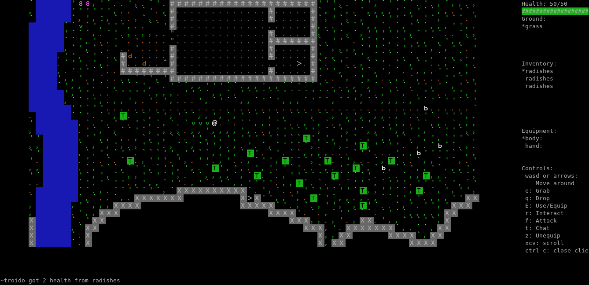

# AsciiFarm

Formerly: **Rooms** 

This is a multiplayer ascii farming/fighting game.

<!-- why doesn't the screenshot get updated? -->

## Working Features

- Multiplayer
- Walking around
- Switching between rooms
- Persistent inventory
- Fighting 
- NPC's
- Farming
- Building
- Chat
- World persistence

## Installation/starting instructions

Requires python3, tested to work on at least python 3.5.2 in linux

Requires Hy to be installed.

Because of the use of NCURSES, it probably won't work on windows (will be fixed later)

It works on a mac, but when testing abstract domain sockets didn't work.
Use the command line argument `-s inet` for both client and server to run this on a mac.

Not on pypi yet, but you should be able to install it like this:

    python -m pip install git+https://github.com/jmdejong/Asciifarm.git

Then you can run `hostfarm` to start the server and `asciifarm` to play the
game!

### Playing instructions

Controls can be configured.
These are the default controls:

Use the arrow keys or wasd to move around.
Use 'e' to add an item from the ground into your inventory.
Use 'q' to drop the top item in your inventory.
Use 'E' to use/interact with the top item in your inventory.
Use 'r' interact with something in the same square as you.
Use 'f' to attack an enemy nearby.
Use 'F' to attack an enemy in the same square as you.
Use WASD to attack enemies in adjacent squares.
Use 't' to open the chat input

### Advanced installation instructions

See [install.md](docs/install.md).

## Vision/ideas

> basically farmville where you can visit friends gardens to see stuff. maybe leave an ascii character as a present        ~m455

> ... makes me wish instead of irc we were hanging out in a central plaza or bazaar of a roguelike, with little @ signs talking to each other, walking into private buildings to send PMs, etc      ~d_m

The idea is to make 3 different kind of areas:

- private areas, where players can build their own house/farm
  * these areas will be the only one where players can build
  * other players can only enter with permission of the owner
  * maybe some group areas too? (that can be bought with in-game currency)
- public areas, where players can interact with each other and npcs
  * towns, where players can trade
  * static dungeons, where monsters spawn
  * whatever levels someone feels like making
  * similar to the world of most mmorpgs
- procedurally generated dungeons, where players can explore and fight for loot
  * like roguelikes
  * if the player dies they can not return to the same dungeon
  * group dungeons would be great too

## TODO first

- typable commands
- refactor display
- authentication
- labels
- make farming more work
- autofight/autoretaliate?
- better reaction on player death
- runtime-created rooms
- display target enemy health
- better code documentation
- testing
- tutorial room
- support websockets
- windows comptibility (libtcod/tdl instead of ncurses?)
- write converter to convert tiled map files to readable files

## Other Ideas

- multicharacter sprites
- plants growing as cellular automata

## DONE

- fix window resizing
- transparent background on sprites
- list scrolling (inventory, ground, equipment)
- display equipment
- better inventory selection
- in-game chat
- relative position room transitions
- custom world persistence (json)
- defense/armour
- nondeterminism in combat, grow times and spawn times
- equipment
- world persistence
- log messages in client to file
- room unloading when there are no players
- merge package brach
- only plant seeds in soil
- make idle NPC's stay around spawn
- messages in the client
- sort objects on ground on height
- follow player when room larger than terminal
- multiple actions per keypress
- healthbar
- colours
- fullwidth characters as sprites
- load world from files
- more content (rooms, objects etc)
- multiple socket types (regular unix, abstract unix, inet), selectable as command line arguments
- configurable graphics
- configurable keybindings
- make items usable
- farming
- loot
- more efficient target detection for monsters
- more efficient drawing/communication by only updating changed squares
- growing plants
- monster/object spawners
- healing
- make health persistent
- make server robust to invalid messages
- attack cooldown
- add enemies
- factions
- add combat
- improve inventory: probably store it in Player instead of Playerent
- better interaction system
- more code reusability in gameobjects
- avoid long files
